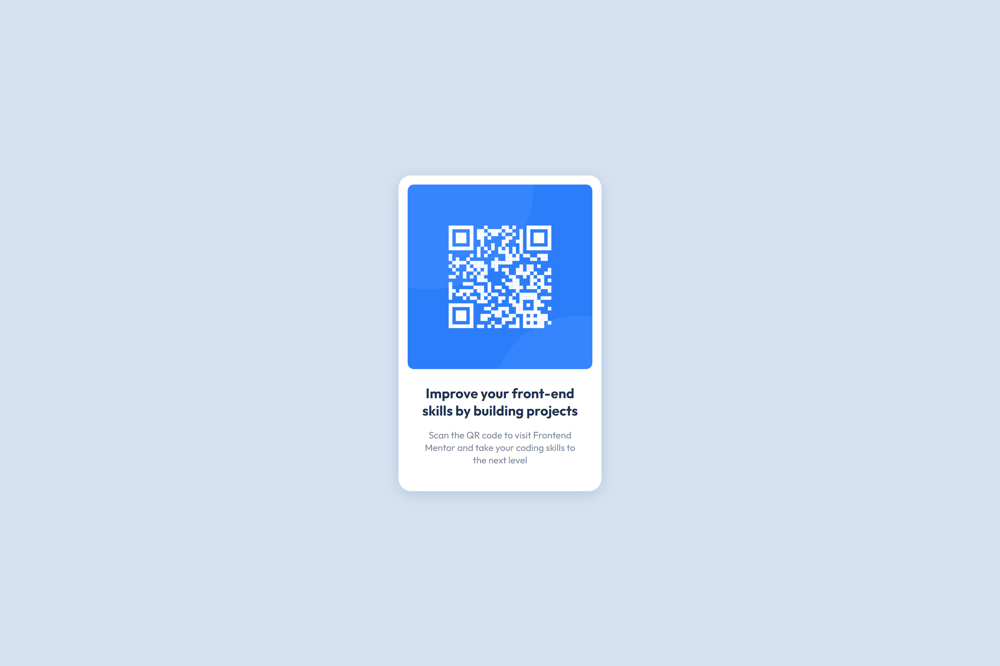

# Frontend Mentor - QR code component solution

Frontend Mentor Challenge URL: [QR code component challenge on Frontend Mentor](https://www.frontendmentor.io/challenges/qr-code-component-iux_sIO_H).

Live Site URL: [QR component link](https://kom42ec.github.io/QR-code-component/).

## Overview

The challenge is to build out QR code component and get it looking as close to the desing as possible. There were no Figma or Sketch files, only the screenshot of the component as a jpg file. Basic style guide was included.

## Screenshot Desktop 1440px width

## Screenshot Mobile 375px width

## Built with

- Semantic HTML5 markup
- CSS custom properties
- Flexbox

## Author

- Frontend Mentor - [@kom42ec](https://www.frontendmentor.io/profile/kom42ec)
- Twitter - [@kom42ec](https://twitter.com/kom42ec)
